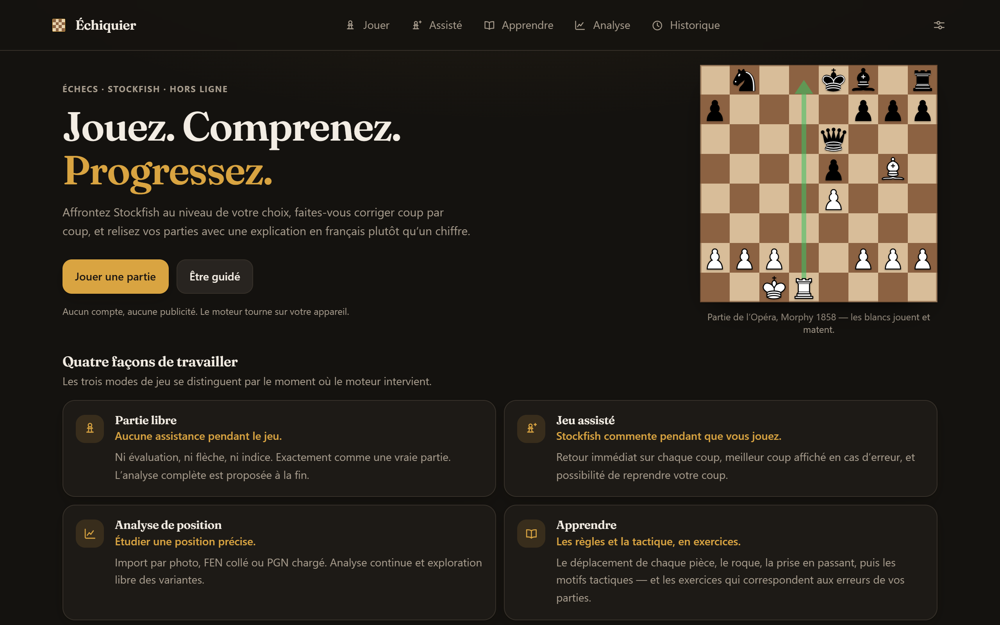
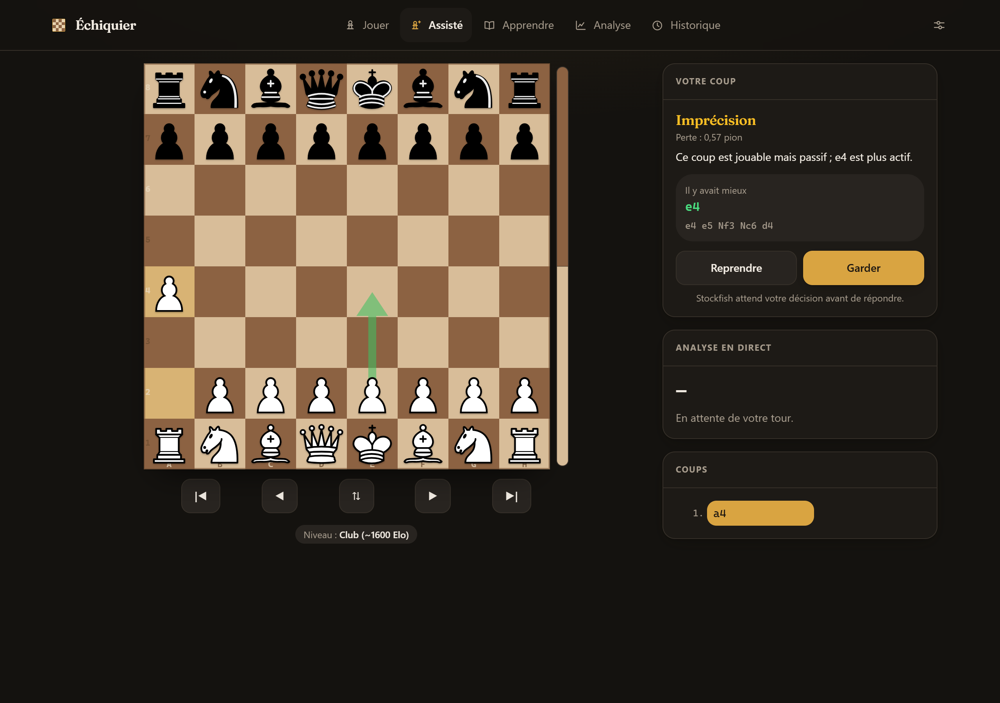
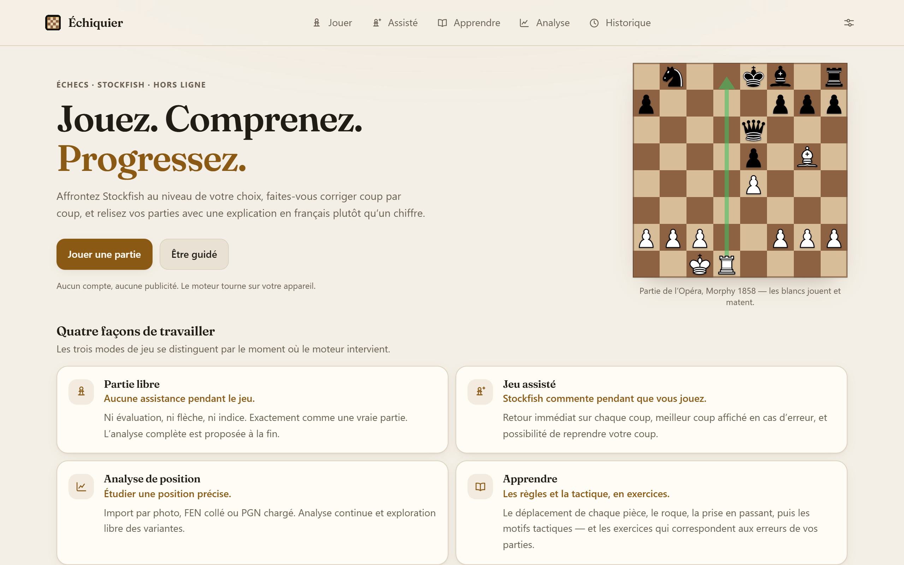
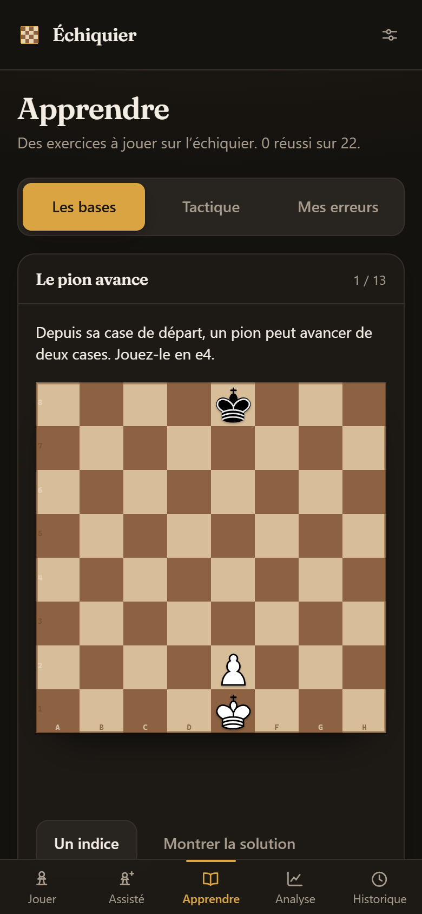

<div align="center">

# Échiquier

**Jouez. Comprenez. Progressez.**

Une application web d'échecs qui explique vos coups en français, plutôt que de
vous donner un chiffre. Stockfish tourne dans votre navigateur : pas de compte,
pas de publicité, et tout fonctionne hors ligne.

[**→ Essayer l'application**](https://echiquier-stockfish-analyse.netlify.app)

</div>



---

## Ce que ça fait

Trois modes de jeu, qui se distinguent par **le moment où le moteur
intervient** — c'est la seule chose à comprendre pour choisir.

| Mode | Pendant la partie | À la fin |
|---|---|---|
| **Partie libre** | Rien. Aucune évaluation, aucune flèche, aucun indice. | Analyse complète proposée. |
| **Jeu assisté** | Verdict après chaque coup, meilleur coup affiché en cas d'erreur, reprise possible. | Analyse complète proposée. |
| **Analyse de position** | Analyse continue, exploration libre des variantes. | — |

S'y ajoute **Apprendre** : les règles en exercices jouables, la tactique par
motif, et les exercices correspondant aux erreurs relevées dans vos parties.



### Les partis pris

**Une seule flèche.** L'échiquier n'affiche **jamais plus d'une flèche**. La
règle tient par construction : le composant `Echiquier` expose une propriété
`fleche` au singulier, pas un tableau. Les lignes MultiPV restent du texte ;
en choisir une remplace la flèche principale au lieu de s'y ajouter.

**Des explications sans chiffre.** `src/lib/explications.ts` produit une phrase
concrète à partir de la seule géométrie de la position et de ce que Stockfish
fournit déjà — aucun appel réseau, aucun modèle de langage, donc utilisable
hors ligne et sans clé.

> Ce coup laisse votre cavalier en e4 en prise.
> Il y avait un mat en 3 coups avec Ta8.
> Votre dame reste menacée par le fou en b4.

La phrase principale ne contient jamais d'évaluation chiffrée : « ce coup vous
coûte 0,77 » n'apprend rien. Le nombre reste affiché à côté, plus petit.

**Six niveaux nommés**, avec leur ordre de grandeur Elo. `Skill Level` seul ne
descend pas assez bas — à 0, Stockfish joue encore vers 1350 Elo — et le
plancher d'`UCI_Elo` est 1320. Les paliers bas brident donc aussi la
**profondeur**, seul levier qui descende plus bas.

`npm run test:niveaux` le vérifie en faisant jouer le moteur contre lui-même :

| Palier | Perte moyenne | Bourdes (≥ 200 cp) |
|---|---|---|
| Débutant (~800) | 150 cp | 8 |
| Amateur (~1200) | 91 cp | 5 |
| Club (~1600) | 40 cp | 2 |
| Maximum | 2 cp | 0 |

**Import d'une position par photo.** Prenez en photo un échiquier réel ou
collez une capture d'écran : la position est transcrite case par case, puis
soumise à un écran de correction avant d'être validée.

## Identité visuelle — « Laiton & Noyer »

La direction est assumée : un club d'échecs, pas un tableau de bord.

- **Fonds chauds** — espresso la nuit, ivoire le jour. Pas de gris bleuté.
- **Un seul accent**, le laiton d'une pendule de tournoi. Il sert aux actions
  principales, à l'onglet actif et au dernier coup joué — et à rien d'autre.
- **Un plateau en noyer**, dessiné par un masque SVG en `crispEdges` plutôt
  qu'un dégradé CSS, pour des arêtes nettes à toutes les tailles. Ses couleurs
  sont les mêmes dans les deux thèmes : le bois d'un échiquier ne change pas
  de teinte selon l'éclairage de la pièce.
- **Fraunces** pour les titres, auto-hébergée en sous-ensemble latin (67 Ko) —
  l'application doit fonctionner hors ligne, et l'en-tête COEP interdit les
  polices tierces. Le corps de texte reste en police système : plus lisible en
  petit corps, et gratuit.
- **Des micro-animations courtes** — 260 ms au maximum, jamais de décalage de
  mise en page, et toutes coupées sous `prefers-reduced-motion`.

Les deux thèmes sont vérifiés au contraste : le texte courant tient 15:1 sur
le fond, le texte secondaire 5,9:1, et l'accent 5,8:1 en thème clair. Aucune
couleur sémantique n'est écrite en classe Tailwind figée — `text-emerald-400`
tombe à 1,9:1 sur l'ivoire —, elles passent toutes par des variables de thème.

<div align="center">

| Thème clair | Mobile (390 px) |
|---|---|
|  |  |

</div>

L'interface est vérifiée à 360 px, 390 px, sur tablette et sur ordinateur, en
thème clair comme en thème sombre : aucun débordement horizontal, aucune cible
tactile sous 44 px.

## Stack technique

| Domaine | Choix |
|---|---|
| Interface | React 19, TypeScript 5.9 (strict) |
| Style | Tailwind CSS 4, variables de thème en CSS natif |
| Échiquier | [Chessground](https://github.com/lichess-org/chessground) — le moteur de rendu de Lichess |
| Règles du jeu | [chess.js](https://github.com/jhlywa/chess.js) |
| Moteur | Stockfish 18.0.8 et 19 en WebAssembly, dans un Web Worker |
| Stockage | IndexedDB via [idb](https://github.com/jakearchibald/idb) — parties et analyses |
| Build | Vite 8, `vite-plugin-pwa` (Workbox) |
| Tests | Vitest (logique pure) + Puppeteer (scénarios en vrai navigateur) |
| Hébergement | Netlify, avec une fonction serverless pour la reconnaissance par image |

Aucune bibliothèque de routage, de graphiques ni de composants : le routeur
tient en quelques lignes de `src/contexte.tsx`, la courbe d'évaluation est une
polyligne SVG, et les briques d'interface sont dans `src/ui/composants.tsx`.
Sur un budget de chargement mobile, chaque dépendance évitée compte.

## Démarrage

```bash
npm install
npm run dev          # développement (COOP/COEP activés) — http://localhost:5173
npm run build        # production
npm run preview      # préversion de dist/ — http://localhost:4173
```

Aucune configuration n'est nécessaire pour jouer, analyser ou s'entraîner.

### Variables d'environnement

Toutes facultatives, et utiles à la seule reconnaissance de position par
photo. Voir [`.env.example`](.env.example) pour le détail.

```bash
cp .env.example .env
```

| Variable | Rôle |
|---|---|
| `ANTHROPIC_API_KEY` | Reconnaissance de position par modèle multimodal. Sans elle, la reconnaissance locale (hors ligne) reste disponible, et l'utilisateur peut saisir sa propre clé dans les réglages. |
| `ANTHROPIC_BASE_URL` | Passerelle compatible avec l'API Anthropic, si vous en utilisez une. |

Ces variables sont lues **uniquement** par la fonction serverless, côté
serveur : aucune clé n'entre jamais dans le bundle envoyé au navigateur.

### Scripts utiles

```bash
npm test                        # tests unitaires (logique critique)
npm run test:navigateur         # test de bout en bout dans un vrai navigateur
npm run test:mise-en-page       # 7 écrans x 4 largeurs x 2 thèmes : débordement,
                                # cibles tactiles, erreurs de console
npm run test:tout               # la suite complète, unitaire et navigateur
npm run preview:sans-isolation  # sert dist/ SANS COOP/COEP, pour éprouver
                                # le repli mono-thread de Stockfish
npm run icones                  # régénère les icônes PWA
npm run captures                # régénère les captures du README
```

Les tests navigateur supposent qu'une préversion tourne sur le port 4173 et
que Chrome ou Edge est installé. Ils vérifient le rendu en 360 px et 390 px,
l'absence de débordement horizontal et d'erreur de console, et surtout que
Stockfish répond réellement.

## Architecture

```
src/
  lib/           logique pure, testée : FEN, UCI, classification, PGN, ouvertures
  engine/        service moteur — détection de capacités + worker Stockfish
  analysis/      analyse incrémentale d'une partie complète
  recognition/   reconnaissance de position (interface + deux implémentations)
  hooks/         état de partie, moteur, raccourcis clavier et gestes
  ui/            briques d'interface, icônes, échiquier (Chessground), écran de correction
  pages/         les écrans (accueil, jeu, analyse, apprendre, rapport, réglages)
netlify/functions/
  reconnaitre.mjs  proxy vers le modèle multimodal — garde la clé d'API hors du bundle
```

### Moteur

Stockfish 18.0.8 compilé en WebAssembly, dans un Web Worker. Le protocole UCI
est encapsulé dans `src/engine/moteur.ts` : `analyser({fen, profondeur,
tempsMs, multiPV, infinie, niveau, signal})`, `arreter()`, événements de
progression. Les recherches sont **sérialisées** — une nouvelle position n'est
jamais envoyée avant le `bestmove` de la précédente, sinon les évaluations
retournées sont fausses.

Les builds **lite** (~7 Mo) sont embarqués plutôt que les builds complets
(113 Mo), qu'aucun mobile ne téléchargerait.

### Reconnaissance de position

`PositionRecognizer` (`src/recognition/types.ts`) expose deux implémentations
interchangeables, sélectionnables dans les réglages :

- **Vision par modèle de langage** — l'image part vers une fonction serverless
  qui détient la clé d'API, jamais directement vers l'API du modèle. Sortie
  JSON contrainte par schéma : plateau 8×8 + confiance par case.
- **Vision locale** — détection de la grille par énergie de gradient,
  découpage en 64 cases, extraction du trait de la pièce par écart à la
  couleur de case, classification par comparaison de silhouettes. Aucun octet
  ne quitte l'appareil.

Le FEN produit passe **systématiquement** par `validateFenLegality` avant
affichage, et par un **écran de correction** avant validation.

### Clé d'API

Deux sources, dans cet ordre :

1. `ANTHROPIC_API_KEY` configurée sur Netlify (cas nominal, rien à faire côté
   utilisateur) ;
2. à défaut, une clé saisie dans **Réglages → Reconnaissance par image**,
   stockée uniquement dans le `localStorage` de l'appareil et transmise à la
   fonction serverless en en-tête.

La clé n'est jamais incluse dans le bundle client.

## Performance mobile

- Moteur dans un Web Worker : le thread principal ne se fige jamais.
- Chessground pour l'échiquier — animations en `transform` uniquement.
- Chargement paresseux des écrans lourds ; le moteur n'est téléchargé qu'à la
  première analyse.
- Le service worker **ne pré-cache pas** le moteur (14 Mo) : il est mis en
  cache à l'usage, sur une URL versionnée (`/engine/sf18/`) donc immuable —
  ce qui interdit structurellement de servir un WASM périmé après mise à jour.
- Analyse de fin de partie **incrémentale** : chaque coup est publié dès qu'il
  est calculé, le rapport se remplit progressivement.
- Table de hachage réglée dynamiquement : 16 Mo sur iOS (au-delà, Safari fait
  recharger l'onglet), 32 Mo sur les autres mobiles, 128 Mo sur ordinateur.

### Hors ligne et multi-thread : pourquoi un repli

Le build multi-thread démarre ses threads secondaires avec une URL de script
suffixée d'un fragment propre à chaque thread (`...js#<wasm>,worker`), ajouté
par emscripten. L'API Cache indexant **fragment compris**, ces requêtes ne
correspondent à aucune entrée du cache.

Les faire correspondre n'est pas la solution : intercepter les requêtes des
threads secondaires depuis le service worker les empêche de démarrer, y
compris en ligne. C'est mesuré, pas supposé — la règle de cache reste donc
une expression régulière qui les ignore délibérément.

L'application procède autrement :

1. en ligne, le multi-thread est utilisé quand le contexte est isolé ;
2. une fois le moteur prêt, le build **mono-thread** est téléchargé en
   arrière-plan, sauf connexion économe ou `saveData` ;
3. hors ligne, les threads secondaires échouent, le moteur bascule
   automatiquement sur le mono-thread déjà en cache et rejoue les recherches
   en attente.

Résultat mesuré : hors ligne, le moteur répond en environ 400 ms. Le coût est
un téléchargement d'arrière-plan de 7 Mo, une seule fois, et jamais sur une
connexion signalée comme limitée.

## Compatibilité

Cible de build **ES2020**, `browserslist` configuré pour iOS 15+, Safari 15+,
Chrome 80+, Android 9+, Samsung Internet 12+.

`SharedArrayBuffer` est détecté au démarrage. S'il est absent (WebView Android,
contexte non isolé, en-têtes non appliqués), l'application bascule
automatiquement sur le build mono-thread et réduit la profondeur par défaut,
sans erreur bloquante — au pire un message discret sur la page de diagnostic.
Ce repli est couvert par `npm run preview:sans-isolation`.

Aucune API moderne n'est utilisée sans détection préalable :
`createImageBitmap`, `canvas.toBlob`, `navigator.storage`, `clipboard`,
`MediaQueryList.addEventListener`, `ReadableStream` ont tous un repli.

## Déploiement

Netlify, configuration dans `netlify.toml` :

- `Cross-Origin-Opener-Policy: same-origin` et
  `Cross-Origin-Embedder-Policy: require-corp` sur tout le site, ce qui rend
  `SharedArrayBuffer` disponible et donc Stockfish multi-thread. Toutes les
  sous-ressources sont de même origine, `require-corp` ne casse donc rien.
- `/engine/sf18/*` en cache immuable un an ; `index.html`, `sw.js` et le
  manifeste en `must-revalidate`.
- Redirection SPA en dernier, après les fonctions.

Site en production : **https://echiquier-stockfish-analyse.netlify.app**

La reconnaissance par modèle fonctionne sans configuration : Netlify injecte
`ANTHROPIC_API_KEY` et `ANTHROPIC_BASE_URL` pointant vers sa passerelle IA, et
le SDK Anthropic les reprend tels quels. La consommation est donc décomptée du
compte Netlify. Pour utiliser sa propre clé à la place, il suffit de la saisir
dans **Réglages → Reconnaissance par image**.

Deux pièges rencontrés en production, corrigés et documentés ici :

- Netlify sert `.webmanifest` en `application/octet-stream`, ce qui rend
  l'application non installable ; le type est déclaré explicitement.
- Netlify injecte un HUD (`built_with_badge_enabled`) dont l'iframe fixe,
  en z-index maximal, recouvrait deux onglets de la barre de navigation sur
  un écran de 390 px. Désactivé sur le site.

Le schéma de sortie structurée n'accepte pas `minItems`/`maxItems` au-delà de
1 : la forme 8×8 est imposée par la consigne et vérifiée deux fois côté code.

## Tests

`npm test` couvre la logique où une erreur serait silencieuse et coûteuse :

- validation de FEN (syntaxe et légalité, normalisation des roques) ;
- parseur UCI (scores, bornes, MultiPV, `bestmove (none)`, variantes) ;
- classification des coups et calcul de précision ;
- moments charnières ;
- répertoire d'ouvertures et détection des coups de théorie ;
- export PGN annoté, relu par `chess.js` pour vérifier qu'il reste valide.

`npm run test:tout` ajoute quatre scénarios pilotés dans un vrai navigateur,
qui vérifient ce qu'aucun test unitaire ne peut voir :

| Scénario | Ce qu'il éprouve |
|---|---|
| `test:navigateur` | Rendu en 360 et 390 px, absence de débordement horizontal, démarrage réel de Stockfish, analyse continue. |
| `test:assiste` | Verdict après un coup, reprise effective du coup, reconnaissance locale sur une capture d'échiquier réelle. |
| `test:rapport` | Analyse incrémentale complète, précision, moments charnières, graphique. |
| `test:hors-ligne` | Installation du service worker, coupure du réseau, partie et moteur hors ligne. |
| `test:mise-en-page` | Sept écrans, quatre largeurs, deux thèmes : aucun débordement horizontal, aucune cible tactile sous 44 px, aucune erreur de console. |

Ces tests ont trouvé des défauts qu'aucune relecture n'aurait montrés :
détection de grille verrouillée sur un demi-pas, moteur répondant avant que
le joueur ait choisi de reprendre son coup, moteur muet hors ligne.

## Licences des ressources tierces

| Ressource | Licence |
|---|---|
| Stockfish (WebAssembly) | GPLv3 — `public/engine/sf18/LICENSE-stockfish.txt` |
| Pièces « cburnett » (via Chessground) | GPLv2+ |
| Police Fraunces | SIL Open Font License 1.1 — `public/fonts/LICENSE-Fraunces.txt` |
